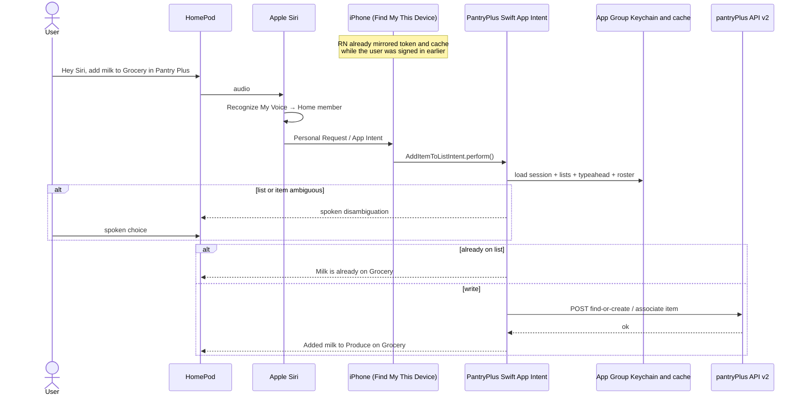

# Siri, HomePod, and App Intents

How a spoken request on a HomePod Mini (or similar) reaches Pantry Plus and the pantryPlus API.

Implementation plan: [plans/phase-5-siri-app-intents.md](./plans/phase-5-siri-app-intents.md).

## Short answers

1. **Which phone?** HomePod does not pick a phone at random on Wi‑Fi. It matches the speaker’s voice to a Home member, then relays the request to **that person’s primary iPhone or iPad** (the device whose Find My **My Location** is **This Device**).
2. **Must the app be open?** No. The UI does not need to be on screen. iOS can run the App Intent in the background on a reachable, signed-in phone. The app **does** need to have been opened at least once after install so auth and cache can be mirrored into the App Group.
3. **Does the request go through the app to hit the API?** Yes — but through **native Swift App Intents inside the Pantry Plus iOS binary**, not through React Native / JavaScript. HomePod never calls the pantryPlus API itself.

---

## 1. How does HomePod know which phone to route to?

HomePod is a **Siri front-end and speaker**. It does not install Pantry Plus and it does not talk to pantryPlus API. Routing is a two-step Apple identity lookup.

### Step A — Who is speaking?

Each household member (up to six) must:

- Have their **own Apple Account** and their **own iPhone or iPad**
- Be invited into the home in the **Home** app
- Turn on **Recognize My Voice** (Home app → Home Settings → their profile)

HomePod compares the live utterance to those enrolled voices and binds the request to **that Home member**. Guests without voice recognition can still use generic HomePod Siri (timers, weather, music on the primary user’s account) but **cannot** run personal third-party intents such as Pantry Plus.

If the voice is unclear, Siri may ask *who you are*. Two Apple Accounts trained on the same voice will confuse routing.

### Step B — Which of that person’s devices?

Personal Requests (Apple’s Home UI also labels this **Personal Content**) run against the recognized person’s **primary** iPhone or iPad: the device with Settings → [your name] → Find My → **My Location** = **This Device**.

That is the same “primary device” rule Apple documents for HomePod media routing. A second iPhone, an old iPad left at home, or a watch is **not** used unless it is the Find My location source.

The phone and HomePod must be on the **same Wi‑Fi** and the phone must be reachable (powered on, not in airplane mode, not away from that network). Some personal actions also send an **authentication notification** to that iPhone.

### What about Pantry Plus must already be true on that phone

- Pantry Plus installed
- User signed in (Cognito session mirrored to the App Group Keychain)
- Siri allowed to use the app (first use may prompt on the iPhone)

### Example

Alex and Sam share a HomePod. Alex says *“Hey Siri, add milk to my grocery list in Pantry Plus.”*

1. HomePod matches Alex’s voice → Alex’s Home member.
2. Apple relays the personal request to **Alex’s** iPhone (Find My “This Device”).
3. That iPhone runs Pantry Plus’s `AddItemToListIntent`.
4. Siri speaks the result on the **HomePod**.

Sam’s phone is ignored, even if it is closer or has the app open.

---

## 2. Does the mobile app need to be open?

**The UI does not need to be open.** Phase 5 intents are designed to run without foregrounding the app (`openAppWhenRun = false` / background `supportedModes`).

Siri on the phone, Shortcuts, and HomePod Personal Requests can all invoke `perform()` while Pantry Plus is:

- In the background
- Suspended
- Not showing any UI

iOS may start (or wake) the **Pantry Plus process** just long enough to run the Swift intent. That is not the same as the user having the app on screen.

### What *is* required

| Required | Not required |
| --- | --- |
| App **installed** on the routed iPhone/iPad | App in the foreground |
| User **opened the app at least once** after install/sign-in so RN can write the App Group session + cache | React Native / MobX running at request time |
| iPhone **on and reachable** (HomePod: same Wi‑Fi) | User looking at the phone |
| Device **unlocked at least once since reboot** (Keychain is `AfterFirstUnlockThisDeviceOnly`) | Screen unlocked at the moment of the request (Allow Siri When Locked should be on) |
| Valid mirrored access token | A live JS session |

### When Siri *will* tell the user to open the app

- Never signed in, or signed out (`needsAuthentication`)
- Token expired and not refreshed (refresh currently happens when RN is active or on token-refresh Hub events)
- App Group cache empty and the intent cannot resolve lists/items
- First-time Siri permission prompt on that iPhone

So: **open once to bootstrap; stay signed in; phone available.** Kitchen use does not require the app to be sitting on the grocery-list screen.

---

## 3. Is the mobile app the layer that hits the pantryPlus API?

**Yes, with a precise meaning of “the app.”**

The live request path is **native Swift compiled into Pantry Plus**, not the Expo/React Native layer and not HomePod.

```
User speech
    → HomePod (mic + speaker only)
    → Apple Siri / Apple Intelligence (NLU, voice ID, device routing)
    → Routed iPhone
    → App Intents: AddItemToListIntent / IsItemOnListIntent.perform()
    → SharedIntentStore (App Group Keychain + JSON cache)
    → PantryApiClient (URLSession)
    → pantryPlus API v2
    → spoken IntentDialog back through Siri to HomePod
```

| Layer | On the live Siri path? | Role |
| --- | --- | --- |
| HomePod | Speech in/out only | No API calls, no Pantry Plus binary |
| Apple Siri / Apple Intelligence | Yes (system) | Parse speech into intent + parameters; pick the person’s device |
| React Native / MobX / Amplify | **No** (not at request time) | Sign-in and **mirror** token, lists, rosters, typeahead into the App Group |
| Swift App Intents in the Pantry Plus binary | **Yes** | Resolve entities, check duplicates, call v2 REST |
| pantryPlus API | Yes | Source of truth for writes and (later) on-list fallback |

That split is why the Phase 5 plan does not deep-link into RN for “add milk”: JS boot + Amplify session would be slow and would require the UI. `PantryApiClient` reads the mirrored Bearer token and `X-Auth-User` email and calls the same v2 endpoints the RN app uses.

Siri does not speak MCP and does not call pantryPlus directly. There is no HomePod target.

### What RN still has to do (ahead of time)

`src/services/intentSync.ts` (via `modules/pantry-intents/`):

1. **`syncIntentSession`** — Cognito access token, email, API base URL → App Group Keychain
2. **`syncIntentCache`** — lists, categories, list rosters, typeahead corpus, last-used list → App Group JSON

Listeners: Amplify Hub (`signedIn` / `tokenRefresh` / `signedOut`), app foreground, and domain/list/typeahead updates.

If that mirror is missing or stale, Swift either fails with a sign-in dialog or answers from an outdated roster.

---

## End-to-end picture



Same intent code runs if the user speaks to Siri **on the iPhone**. HomePod only changes the microphone, speaker, and the extra Personal Requests routing hop.

---

## Setup checklist (HomePod)

From [Apple’s voice recognition / Personal Requests guide](https://support.apple.com/en-us/108397):

- HomePod and iPhone on the **same Wi‑Fi**
- **Recognize My Voice** on for that person
- **Personal Requests / Personal Content** on for that HomePod
- Find My **Share My Location**, **My Location** = **This Device**
- Siri enabled, **Allow Siri When Locked**, language matches HomePod
- Siri saved to iCloud
- Pantry Plus signed in on that iPhone

---

## Key files

| File | Role |
| --- | --- |
| [`plugins/withPantryIntents/`](../plugins/withPantryIntents/) | Swift intents, entities, `PantryApiClient`, `SharedIntentStore` |
| [`modules/pantry-intents/`](../modules/pantry-intents/) | Expo module: RN → App Group session/cache |
| [`src/services/intentSync.ts`](../src/services/intentSync.ts) | When RN refreshes auth and list/typeahead snapshots |

---

## Practical failure modes

| Symptom | Likely cause |
| --- | --- |
| HomePod does nothing useful / generic Siri answer | Voice not recognized; Personal Requests off; app name not in the phrase |
| Request hits the wrong person’s lists | Voice matched the other Home member (or two accounts share one voice) |
| Works on iPhone Siri, fails on HomePod | Phone not on that Wi‑Fi, Find My location is another device, phone asleep/off |
| “Open Pantry Plus to sign in” | No/expired App Group token; user never opened the app after login |
| Stale “already on the list” / missing list | Cache not synced (app never loaded that list while signed in) |
| Works until reboot, then fails until unlock | Keychain not readable until first unlock |
