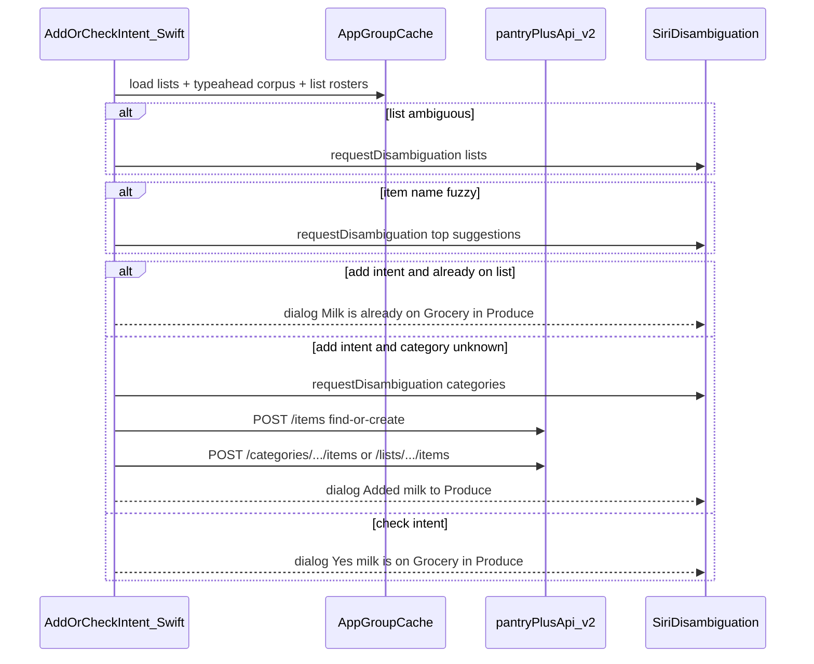

# Phase 5: Siri / App Intents

Parent epic: [#93](https://github.com/askewsoft/pantryPlus/issues/93)
Prerequisite: Item catalog dedupe Phases 0–4 (find-or-create, typeahead, aliases)
Tracking issues: [phase-5-siri-app-intents-github-issues.md](./phase-5-siri-app-intents-github-issues.md)

## Overview

Add native App Intents to Pantry Plus (Expo dev-client) so Siri can **add items to a list** and **ask whether an item is already on a list**, reusing find-or-create + typeahead + category logic from Phases 0–4, with duplicate-aware responses and system-driven disambiguation.

## Current state

- **Phases 0–4 are done:** server find-or-create, household typeahead corpus, aliases, category auto-hint via [`findCategoryIdForItem`](../../src/utils/itemTypeahead.ts).
- **No Siri/App Intents exist today:** greenfield in an Expo 55 / RN dev-client app; iOS is CNG via [`app.json`](../../app.json) + `expo prebuild`.
- **Add-item write path** (reuse, do not reinvent).
- **List membership check** is not exposed as a public API today, but `ItemsService.isOnList` + `itemIsOnList.sql` already exist server-side in `pantryPlusApiTs` (used internally on rename). The app checks duplicates client-side in [`List.addItem`](../../src/stores/models/List.ts) via `alreadyOnList` before calling `associateListItem`. Siri needs the same guard, plus a read-only query intent.



---

## Apple Intelligence: how Siri works now and what to adopt

**Siri is no longer SiriKit-first.** Apple Intelligence routes third-party actions through the **App Intents** framework. You declare intents, entities, and queries in Swift; the compiler exports metadata the system uses for NLU, Shortcuts, Spotlight, widgets, and the rebuilt Siri.

| Capability | Pantry Plus use | Phase |
|---|---|---|
| **App Intents + App Shortcuts** | "Add milk to my grocery list" / "Is milk on my grocery list?" | 5a–5b (required) |
| **`requestDisambiguation(among:dialog:)`** | Pick list, item suggestion, or category when ambiguous | 5b (required) |
| **`EntityQuery` / string matching** | Resolve "Costco run" → `ShoppingListEntity` | 5a |
| **`RelevantEntities`** (WWDC 2026) | Suggest the active / nearby-store list before user speaks | 5c (nice) |
| **`IndexedEntity` + donation** | Spotlight surfaces recent lists/items | 5c (nice) |
| **`PredictableIntent`** | System learns "every Sunday add eggs" | later |
| **`IntentValueQuery` / Visual Intelligence** | Point camera at product → add to list (needs [#7](https://github.com/askewsoft/pantryPlus/issues/7)) | later |
| **On-screen entities** | Select item in app → ask Siri "move this to Dairy" | later |

**What Pantry Plus should *not* do:** embed its own LLM or try to parse speech manually. Speech → structured parameters is Apple's job once intents/entities are declared well. Your job is **good entities, ranked suggestions, and explicit disambiguation** when confidence is low.

**Deployment target:** bump iOS minimum from **15.1 → 16.0** (App Intents baseline). EAS preview/prod already use Xcode 26.2 — fine for current App Intents APIs.

### HomePod Mini support

**Yes — with the same App Intents, no separate HomePod target.** HomePod does not run Pantry Plus natively; it relays the request to the user's **iPhone over Wi‑Fi**, where the intent executes (same as Personal Requests / Siri Shortcuts).

Example flow:

> "Hey Siri, add milk to my grocery list in Pantry Plus" *(HomePod)* → Siri routes to iPhone → `AddItemToListIntent.perform()` → Siri speaks *"Added milk to Produce on Grocery"* on the HomePod speaker.

**User setup required** ([Apple Support](https://support.apple.com/en-us/108397)):

- **Recognize My Voice** enabled in the Home app for that person
- **Personal Requests / Personal Content** enabled for that HomePod (Settings → Home → your profile)
- iPhone on the **same Wi‑Fi network** as the HomePod (not airplane mode / away from home)
- Pantry Plus **signed in** on that iPhone (auth token mirrored to App Group)
- First use may prompt on iPhone to allow Siri access to the app

**HomePod-friendly by design:**

- `requestDisambiguation` and `IntentDialog` are **voice-only** — no screen required (good for kitchen use)
- `IsItemOnListIntent` is ideal on HomePod: *"Do I have milk on the grocery list?"* → spoken yes/no

**HomePod limitations to expect:**

- If iPhone is off, unreachable, or token/cache is stale → spoken error (*"Open Pantry Plus to sign in"*)
- Some requests may send an **auth notification to iPhone** (Apple's Personal Requests behavior)
- Multi-person homes: request routes to the **recognized voice's** iPhone, not a shared device
- Document setup in release notes / help; add HomePod to manual test matrix

---

## MCP Server for Siri? **No.**

**Model Context Protocol (MCP)** is a wire protocol for desktop AI hosts (Cursor, Claude Desktop, etc.). **Siri does not speak MCP.** Siri invokes **App Intents** compiled into your app binary.

| Approach | Siri | Shortcuts | Apple Intelligence |
|---|---|---|---|
| App Intents (Swift) | yes | yes | yes |
| MCP server | no | no | no |

A Pantry Plus MCP server could be a **separate, optional** project — but it would **not** replace or accelerate Siri integration. **Recommendation:** implement App Intents natively; skip MCP for #93.

---

## Architecture (Expo-compatible)

App Intents are **Swift-only, compile-time**. JS/MobX does not run when Siri handles a background intent. Plan for **native execution end-to-end**:

```
pantryPlus/
  plugins/withPantryIntents/          # Expo config plugin (injects Swift into Xcode target)
    ios/
      AppShortcutsProvider.swift
      AddItemToListIntent.swift
      IsItemOnListIntent.swift        # read-only query; no writes
      Entities/  (ShoppingListEntity, CategoryEntity, ItemSuggestionEntity)
      Queries/   (ListEntityQuery, CategoryEntityQuery)
      Services/
        PantryApiClient.swift         # URLSession → v2 REST
        TypeaheadMatcher.swift        # port of itemTypeahead ranking
        ListMembershipChecker.swift   # shared duplicate / on-list logic
        SharedIntentStore.swift       # App Group JSON read/write
    withPantryIntents.js
  modules/pantry-intents/             # thin Expo native module (recommended)
    ios/PantryIntentsModule.swift     # RN → sync cache, refresh shortcut params
    index.ts
```

### Why not deep-link-only?

Deep links require `openAppWhenRun`, RN boot, and Amplify session init — slow and brittle. For "add milk" while driving, **native `perform()`** that calls the same REST endpoints is the right v1.

### Auth bridge

[`SessionService`](../../src/services/SessionService.ts) uses Amplify `fetchAuthSession()`. Intents cannot rely on JS.

1. Add an Expo module method `syncIntentSession({ accessToken, email, apiBaseUrl })` called whenever RN refreshes auth (login, foreground, token refresh).
2. Store credentials in **App Group Keychain** (not plain UserDefaults).
3. `PantryApiClient` reads them; on missing/expired token, throw `needsAuthentication` → Siri dialog: *"Open Pantry Plus to sign in."*

### Entity cache (App Group)

When the app loads data, mirror to shared storage (same shape as typeahead):

- **Lists:** `{ id, name, groupId, categories: [{ id, name }] }`
- **List rosters** (for duplicate / on-list checks): per list, all current items `{ id, name, categoryId?, categoryName? }` — both uncategorized and categorized. Sync whenever [`List.loadListItems`](../../src/stores/models/List.ts) runs and after add/remove in-app.
- **Typeahead corpus:** output of `buildTypeaheadCorpus` (id, name, aliases, upc)
- **Last-used list id** (from `uiStore.selectedShoppingList`)
- **Household list snapshots** for `findCategoryIdForItem` (same lists as [`AddItemModal`](../../src/screens/ListsNavigation/modals/AddItemModal.tsx))

Hook sync in `DomainStore.loadLists`, `loadListItems`, typeahead load, and list selection changes. Call `updateShortcutParameters()` after sync so Siri's parameter pickers stay fresh.

**No new server search endpoint for v1** — corpus is already cohort-scoped and small; port ranking to Swift (~150 lines from [`itemTypeahead.ts`](../../src/utils/itemTypeahead.ts)).

**Optional small API addition (recommended):** expose existing `ItemsService.isOnList` as `GET /v2/lists/{listId}/items/{itemId}/onList` → `{ onList: boolean }`. Gives Siri a cheap id-based fallback when the App Group roster is stale.

---

## Shared service: `ListMembershipChecker`

Both add and check intents use the same Swift helper to answer **"is this item already on this list?"**

| Check | When | How |
|---|---|---|
| **By item id** | After catalog item resolved (add flow) | `roster.contains(itemId)` or `GET .../onList` fallback |
| **By spoken name** | Check flow; add flow tie-break | Rank items **on that list's roster** with `TypeaheadMatcher` |

When on list, report category for richer Siri dialog (from roster `categoryName`, or *uncategorized*).

**Duplicate add policy (confirmed):** inform and skip — no re-add, no "add anyway?" prompt in v1. Later, after quantity tracking ships, Siri may offer to increase quantity.

---

## Primary intent: `AddItemToListIntent`

### Parameters

| Parameter | Type | Required | Notes |
|---|---|---|---|
| `itemName` | `String` | yes | Raw speech/typed name |
| `list` | `ShoppingListEntity?` | no | Siri may infer from phrase |
| `category` | `CategoryEntity?` | no | Optional; resolved in `perform()` if omitted |

### `perform()` algorithm (mirror AddItemModal)

1. **Auth check** → fail with sign-in prompt if no token.
2. **Resolve list** (disambiguate when ambiguous).
3. **Resolve item** via typeahead corpus (disambiguate when fuzzy).
4. **Duplicate check** → if already on list, inform and skip (include category when known).
5. **Resolve category** (only when not already on list).
6. **Write** via `POST /categories/.../items` or `POST /lists/.../items`.
7. **Respond** with `IntentDialog`. **`openAppWhenRun = false`** for v1.

---

## Query intent: `IsItemOnListIntent`

Read-only; **no mutations**. Same list resolution as add; match spoken name against **that list's roster**; spoken yes/no with category when on list.

### App Shortcuts phrases

**Add:**

- "Add {itemName} to {list} in ${applicationName}"
- "Add {itemName} to my ${applicationName} list"

**Check:**

- "Is {itemName} on {list} in ${applicationName}?"
- "Do I have {itemName} on my ${applicationName} list?"

Register via config plugin; add `NSSiriUsageDescription` to [`app.json`](../../app.json).

---

## RN app changes

| File | Change |
|---|---|
| [`app.json`](../../app.json) | Plugin, App Group entitlement, `NSSiriUsageDescription`, iOS 16 deployment target |
| New `modules/pantry-intents/` | `syncIntentCache()`, `syncIntentSession()` |
| [`DomainStore.ts`](../../src/stores/DomainStore.ts) | Sync list metadata after `loadLists` |
| [`List.ts`](../../src/stores/models/List.ts) | Sync roster after `loadListItems` and add/remove |
| [`AddItemModal.tsx`](../../src/screens/ListsNavigation/modals/AddItemModal.tsx) | Sync corpus after typeahead load |
| Auth bootstrap | Call `syncIntentSession` on sign-in / token refresh |

---

## Phased delivery

| Sub-phase | GitHub issue | Deliverable |
|---|---|---|
| **5a — Plumbing** | See issues doc | Config plugin, App Group, auth mirror, entities, cache sync |
| **5b — Add + check (MVP)** | See issues doc | Both intents, membership checker, typeahead port, RN sync |
| **5c — Discovery + test** | See issues doc | Shortcuts phrases, RelevantEntities, test matrix |
| **5d — Later** | See issues doc | Check-off, remove, Visual Intelligence, quantity bump |

**Defer from v1:** purchase/check-off (needs location), alias creation from speech, MCP server, quantity increase on duplicate add.

---

## Testing

1. **Shortcuts app** on device — fastest iteration.
2. **Siri voice** on physical device.
3. **`AppIntentsTestCase`** — disambiguation branches with mocked cache + API.
4. **HomePod Mini** — Personal Requests, same Wi‑Fi, spoken disambiguation + inform-and-skip.

Manual test matrix:

- Exact item name → adds without item prompt
- Near-duplicate names → item disambiguation
- New item → category prompt (if categories exist)
- Item already on list → inform and skip
- "Is milk on the list?" → yes/no with category
- Multiple lists → list disambiguation
- Signed out → sign-in message

---

## Success criteria (#93)

- **Add:** "Hey Siri, add milk to my grocery list in Pantry Plus" → item on list.
- **Check:** "Hey Siri, is milk on my grocery list?" → yes/no with category.
- **Duplicate add:** informs and skips — no duplicate list row.
- **Disambiguation:** list, item suggestions, category when needed.
- **Catalog identity:** find-or-create + aliases from Phase 4.
